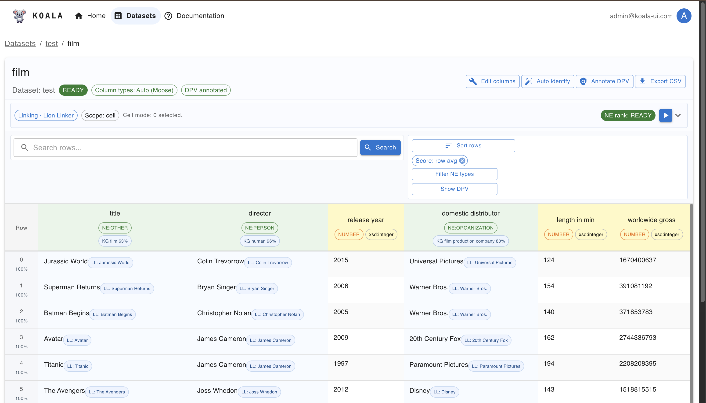

  <h1>Koala UI</h1>
  

## **General Description**
Koala UI is a web user interface that supports semantic annotation and human-in-the-loop review of tabular data. It lets users explore datasets, inspect tables, run entity linking and annotation jobs, and export enriched CSV files. The UI is designed to make enrichment workflows transparent and auditable by domain experts and data stewards.

## **Related Compliance aspects**
- Semantic annotation
- Human-in-the-loop validation to support compliant data enrichment
- Data review and quality assurance for enrichment outputs

## **Main Goal/Functionalities**
- Interactive dataset exploration and filtering
- Manual and assisted semantic annotation of table columns and cells
- Entity linking integration (e.g., Lion Linker)
- DPV annotation support
- Export of enriched datasets for downstream processing

## **Architecture**
Koala UI is a React-based front-end that communicates with a Flask backend. The backend manages datasets and table metadata, orchestrates annotation and linking jobs, and handles export of enriched data. External linking/annotation services can be integrated via backend APIs.

## **Component Definition**
Koala UI provides the human-facing interface for semantic enrichment workflows. It supports dataset ingestion, column type management, entity linking and disambiguation, and validation of suggested annotations. Users can review candidate entities, adjust annotations, and export enriched tables. The UI integrates with backend services that manage data storage and invoke external enrichment services.

## **Screenshots**

## **Commercial Information**

| Organisation (s) | License Nature | License |
|------------------|----------------|---------|
| SINTEF | Open Source | MIT |

## **Expected KPIs**

| What (types) | How (Process) | Values |
|--------------|----------------|--------|
| **Multi-Algorithm Integration** | Validate integration of multiple enrichment engines through backend APIs. Perform end-to-end execution using different engines without modifying the UI layer. | Successful integration and execution of at least 3 enrichment engines: Lion-Linker, Crocodile, and OpenRefine-based reconciliation |
| **Column Type Classification Support (DPV / NER / NE-LIT)** | Demonstrate column-level classification capabilities using DPV-based labels, NER-based schemas (coarse and fine types), and NE/LIT distinction. Validate outputs on representative tables. | Support configurable column type classification including DPV categories, NER-based types (coarse and fine), and NE vs LIT distinction |
| **Enriched Table Export** | Validate export of processed tables after linking and review. | 100% of exported tables include canonical entity identifiers and available enrichment metadata (e.g., confidence scores when provided by the linking engine) |

## **Related Project Links**
| Project Links |
| ------------- | 	
| Software GitHub Repository --> Koala UI (upstream) <https://github.com/enRichMyData/koala_ui> |

## **How To Install**
See the upstream repository for installation and setup instructions: <https://github.com/enRichMyData/koala_ui>

### Detailed steps

n/a

## **How To Use**
1. Start the Koala UI backend and front-end following the upstream instructions.
2. Open the web UI and load a dataset.
3. Define or review column types, then run entity linking and annotation.
4. Validate and adjust annotations as needed.
5. Export the enriched dataset.

## **Other Information**

n/a

## **OpenAPI Specification**

n/a

## **Additional Links**

n/a
